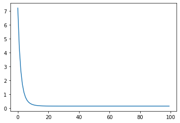

#  随机梯度下降SGD


```python
import matplotlib.pyplot as plt
```


```python
x_data=[1.0,2.0,3.0]
y_data=[2.0,3.4,6.5]
w=1.0
```


```python
def forward(x):
    return x*w
```


```python
def loss(x,y):
    y_pred=forward(x)
    return (y_pred-y)**2
```


```python
def gradient(x,y):
    return 2*x*(x*w-y)
```


```python
print("Predict (benfore training )",4,forward(4))
epoch_list=[]
loss_list=[]
for epoch in range(100):
    epoch_list.append(epoch)
    for x,y in zip(x_data,y_data):
        grad=gradient(x,y)
        w-=0.01*grad
        print('/tgrad:',x,y,grad)
    l=loss(x,y)
    loss_list.append(l)
    print('progress:',epoch,'w=',w,'loss=:',l )
print('Predict(after training)',4,forward(4))
```

    Predict (benfore training ) 4 4.0
    /tgrad: 1.0 2.0 -2.0
    /tgrad: 2.0 3.4 -5.4399999999999995
    /tgrad: 3.0 6.5 -19.6608
    progress: 0 w= 1.271008 loss=: 7.219840024576002
    /tgrad: 1.0 2.0 -1.4579840000000002
    /tgrad: 2.0 3.4 -3.315297280000001
    /tgrad: 3.0 6.5 -15.262665369600004
    progress: 1 w= 1.471367466496 loss=: 4.35096879982172
    /tgrad: 1.0 2.0 -1.0572650670080002
    /tgrad: 2.0 3.4 -1.7444790626713598
    /tgrad: 3.0 6.5 -12.011071659729716
    progress: 2 w= 1.6194956243900909 loss=: 2.6945653455543073
    /tgrad: 1.0 2.0 -0.7610087512198183
    /tgrad: 2.0 3.4 -0.5831543047816865
    /tgrad: 3.0 6.5 -9.60712941089809
    progress: 3 w= 1.729008549059087 loss=: 1.7239016511702894
    /tgrad: 1.0 2.0 -0.5419829018818261
    /tgrad: 2.0 3.4 0.27542702462324264
    /tgrad: 3.0 6.5 -7.829866059029886
    progress: 4 w= 1.8099727684219717 loss=: 1.1450748334049705
    /tgrad: 1.0 2.0 -0.3800544631560565
    /tgrad: 2.0 3.4 0.9101865044282587
    /tgrad: 3.0 6.5 -6.51591393583351
    progress: 5 w= 1.8698305873675847 loss=: 0.7930049217628572
    /tgrad: 1.0 2.0 -0.26033882526483065
    /tgrad: 2.0 3.4 1.3794718049618648
    /tgrad: 3.0 6.5 -5.5444933637289395
    progress: 6 w= 1.9140841912079036 loss=: 0.5741811621798897
    /tgrad: 1.0 2.0 -0.17183161758419274
    /tgrad: 2.0 3.4 1.726420059069964
    /tgrad: 3.0 6.5 -4.826310477725176
    progress: 7 w= 1.9468014115702976 loss=: 0.4350665735873229
    /tgrad: 1.0 2.0 -0.10639717685940475
    /tgrad: 2.0 3.4 1.982923066711134
    /tgrad: 3.0 6.5 -4.295349251907954
    progress: 8 w= 1.97098964519086 loss=: 0.3446054706027902
    /tgrad: 1.0 2.0 -0.0580207096182801
    /tgrad: 2.0 3.4 2.172558818296343
    /tgrad: 3.0 6.5 -3.902803246126572
    progress: 9 w= 1.9888722965653451 loss=: 0.2844975423575315
    /tgrad: 1.0 2.0 -0.022255406869309713
    /tgrad: 2.0 3.4 2.3127588050723062
    /tgrad: 3.0 6.5 -3.612589273500328
    progress: 10 w= 2.0020931553183186 loss=: 0.2437599657377238
    /tgrad: 1.0 2.0 0.004186310636637103
    /tgrad: 2.0 3.4 2.416410337695618
    /tgrad: 3.0 6.5 -3.398030600970074
    progress: 11 w= 2.011867494844697 loss=: 0.21566505237091002
    /tgrad: 1.0 2.0 0.023734989689393693
    /tgrad: 2.0 3.4 2.4930411595824236
    /tgrad: 3.0 6.5 -3.239404799664385
    progress: 12 w= 2.0190937813486225 loss=: 0.19599980832983394
    /tgrad: 1.0 2.0 0.03818756269724499
    /tgrad: 2.0 3.4 2.5496952457732025
    /tgrad: 3.0 6.5 -3.122130841249472
    progress: 13 w= 2.024436261676413 loss=: 0.18206539293322427
    /tgrad: 1.0 2.0 0.048872523352826214
    /tgrad: 2.0 3.4 2.59158029154308
    /tgrad: 3.0 6.5 -3.0354287965058226
    progress: 14 w= 2.0283860214925125 loss=: 0.17209383146802268
    /tgrad: 1.0 2.0 0.05677204298502492
    /tgrad: 2.0 3.4 2.6225464085012984
    /tgrad: 3.0 6.5 -2.97132893440231
    progress: 15 w= 2.0313061263216725 loss=: 0.16490228294239875
    /tgrad: 1.0 2.0 0.06261225264334502
    /tgrad: 2.0 3.4 2.6454400303619128
    /tgrad: 3.0 6.5 -2.9239391371508425
    progress: 16 w= 2.0334649948631283 loss=: 0.15968416834131802
    /tgrad: 1.0 2.0 0.06692998972625652
    /tgrad: 2.0 3.4 2.6623655597269273
    /tgrad: 3.0 6.5 -2.88890329136526
    progress: 17 w= 2.0350610722822493 loss=: 0.15588029225948208
    /tgrad: 1.0 2.0 0.07012214456449861
    /tgrad: 2.0 3.4 2.6748788066928366
    /tgrad: 3.0 6.5 -2.863000870145825
    progress: 18 w= 2.0362410714711348 loss=: 0.15309752293897916
    /tgrad: 1.0 2.0 0.07248214294226951
    /tgrad: 2.0 3.4 2.684130000333697
    /tgrad: 3.0 6.5 -2.8438508993092473
    progress: 19 w= 2.0371134590314677 loss=: 0.15105630247712085
    /tgrad: 1.0 2.0 0.07422691806293535
    /tgrad: 2.0 3.4 2.6909695188067086
    /tgrad: 3.0 6.5 -2.829693096070109
    progress: 20 w= 2.0377584256234726 loss=: 0.1495560114796519
    /tgrad: 1.0 2.0 0.0755168512469453
    /tgrad: 2.0 3.4 2.6960260568880248
    /tgrad: 3.0 6.5 -2.8192260622417873
    progress: 21 w= 2.038235257164541 loss=: 0.1484516425203239
    /tgrad: 1.0 2.0 0.07647051432908203
    /tgrad: 2.0 3.4 2.6997644161700034
    /tgrad: 3.0 6.5 -2.8114876585280957
    progress: 22 w= 2.038587784444831 loss=: 0.1476378006407533
    /tgrad: 1.0 2.0 0.07717556888966204
    /tgrad: 2.0 3.4 2.7025282300474753
    /tgrad: 3.0 6.5 -2.805766563801722
    progress: 23 w= 2.038848412093477 loss=: 0.14703755581923109
    /tgrad: 1.0 2.0 0.07769682418695378
    /tgrad: 2.0 3.4 2.70457155081286
    /tgrad: 3.0 6.5 -2.8015368898173794
    progress: 24 w= 2.0390410972416526 loss=: 0.14659457373953141
    /tgrad: 1.0 2.0 0.07808219448330522
    /tgrad: 2.0 3.4 2.7060822023745583
    /tgrad: 3.0 6.5 -2.7984098410846627
    progress: 25 w= 2.0391835516839207 loss=: 0.14626750145133652
    /tgrad: 1.0 2.0 0.07836710336784147
    /tgrad: 2.0 3.4 2.7071990452019374
    /tgrad: 3.0 6.5 -2.7960979764319873
    progress: 26 w= 2.0392888699625424 loss=: 0.14602592783877447
    /tgrad: 1.0 2.0 0.07857773992508488
    /tgrad: 2.0 3.4 2.7080247405063336
    /tgrad: 3.0 6.5 -2.79438878715189
    progress: 27 w= 2.0393667330297474 loss=: 0.14584745793567655
    /tgrad: 1.0 2.0 0.07873346605949472
    /tgrad: 2.0 3.4 2.7086351869532184
    /tgrad: 3.0 6.5 -2.7931251630068417
    progress: 28 w= 2.0394242981296884 loss=: 0.1457155831581018
    /tgrad: 1.0 2.0 0.07884859625937679
    /tgrad: 2.0 3.4 2.7090864973367577
    /tgrad: 3.0 6.5 -2.792190950512907
    progress: 29 w= 2.0394668566988563 loss=: 0.14561812490262396
    /tgrad: 1.0 2.0 0.0789337133977126
    /tgrad: 2.0 3.4 2.709420156519032
    /tgrad: 3.0 6.5 -2.7915002760056034
    progress: 30 w= 2.0394983207597446 loss=: 0.14554609380632297
    /tgrad: 1.0 2.0 0.07899664151948915
    /tgrad: 2.0 3.4 2.7096668347563995
    /tgrad: 3.0 6.5 -2.7909896520542574
    progress: 31 w= 2.039521582517528 loss=: 0.14549285180962368
    /tgrad: 1.0 2.0 0.07904316503505626
    /tgrad: 2.0 3.4 2.709849206937422
    /tgrad: 3.0 6.5 -2.790612141639537
    progress: 32 w= 2.039538780214199 loss=: 0.14545349562484422
    /tgrad: 1.0 2.0 0.07907756042839775
    /tgrad: 2.0 3.4 2.7099840368793213
    /tgrad: 3.0 6.5 -2.790333043659807
    progress: 33 w= 2.0395514946777196 loss=: 0.14542440254801642
    /tgrad: 1.0 2.0 0.07910298935543914
    /tgrad: 2.0 3.4 2.7100837182733226
    /tgrad: 3.0 6.5 -2.7901267031742236
    progress: 34 w= 2.0395608946331745 loss=: 0.1454028955580708
    /tgrad: 1.0 2.0 0.07912178926634894
    /tgrad: 2.0 3.4 2.7101574139240885
    /tgrad: 3.0 6.5 -2.789974153177141
    progress: 35 w= 2.039567844133041 loss=: 0.14538699620490594
    /tgrad: 1.0 2.0 0.0791356882660823
    /tgrad: 2.0 3.4 2.7102118980030436
    /tgrad: 3.0 6.5 -2.7898613711337035
    progress: 36 w= 2.039572981981687 loss=: 0.14537524218124578
    /tgrad: 1.0 2.0 0.07914596396337359
    /tgrad: 2.0 3.4 2.7102521787364235
    /tgrad: 3.0 6.5 -2.789777990015603
    progress: 37 w= 2.0395767804548446 loss=: 0.14536655259600462
    /tgrad: 1.0 2.0 0.07915356090968917
    /tgrad: 2.0 3.4 2.7102819587659805
    /tgrad: 3.0 6.5 -2.789716345354419
    progress: 38 w= 2.039579588711632 loss=: 0.1453601284483412
    /tgrad: 1.0 2.0 0.07915917742326428
    /tgrad: 2.0 3.4 2.7103039754991958
    /tgrad: 3.0 6.5 -2.789670770716665
    progress: 39 w= 2.039581664889574 loss=: 0.1453553790901528
    /tgrad: 1.0 2.0 0.0791633297791483
    /tgrad: 2.0 3.4 2.7103202527342614
    /tgrad: 3.0 6.5 -2.78963707684008
    progress: 40 w= 2.039583199832841 loss=: 0.1453518678825366
    /tgrad: 1.0 2.0 0.07916639966568173
    /tgrad: 2.0 3.4 2.7103322866894732
    /tgrad: 3.0 6.5 -2.7896121665527964
    progress: 41 w= 2.0395843346348173 loss=: 0.14534927203187897
    /tgrad: 1.0 2.0 0.0791686692696345
    /tgrad: 2.0 3.4 2.7103411835369666
    /tgrad: 3.0 6.5 -2.7895937500784775
    progress: 42 w= 2.0395851736075357 loss=: 0.145347352903242
    /tgrad: 1.0 2.0 0.07917034721507132
    /tgrad: 2.0 3.4 2.7103477610830797
    /tgrad: 3.0 6.5 -2.7895801345580225
    progress: 43 w= 2.0395857938701343 loss=: 0.14534593407655635
    /tgrad: 1.0 2.0 0.07917158774026856
    /tgrad: 2.0 3.4 2.710352623941853
    /tgrad: 3.0 6.5 -2.7895700684403657
    progress: 44 w= 2.039586252437717 loss=: 0.14534488512541324
    /tgrad: 1.0 2.0 0.0791725048754337
    /tgrad: 2.0 3.4 2.7103562191117003
    /tgrad: 3.0 6.5 -2.78956262643878
    progress: 45 w= 2.0395865914622333 loss=: 0.14534410962568028
    /tgrad: 1.0 2.0 0.07917318292446662
    /tgrad: 2.0 3.4 2.710358877063909
    /tgrad: 3.0 6.5 -2.789557124477712
    progress: 46 w= 2.0395868421071266 loss=: 0.1453435362907517
    /tgrad: 1.0 2.0 0.07917368421425319
    /tgrad: 2.0 3.4 2.710360842119874
    /tgrad: 3.0 6.5 -2.78955305681186
    progress: 47 w= 2.0395870274119043 loss=: 0.14534311241808512
    /tgrad: 1.0 2.0 0.07917405482380868
    /tgrad: 2.0 3.4 2.710362294909329
    /tgrad: 3.0 6.5 -2.789550049537686
    progress: 48 w= 2.0395871644099497 loss=: 0.14534279904433442
    /tgrad: 1.0 2.0 0.07917432881989939
    /tgrad: 2.0 3.4 2.710363368974006
    /tgrad: 3.0 6.5 -2.7895478262238065
    progress: 49 w= 2.039587265694249 loss=: 0.1453425673635769
    /tgrad: 1.0 2.0 0.07917453138849773
    /tgrad: 2.0 3.4 2.7103641630429127
    /tgrad: 3.0 6.5 -2.789546182501171
    progress: 50 w= 2.0395873405749465 loss=: 0.14534239607933208
    /tgrad: 1.0 2.0 0.07917468114989301
    /tgrad: 2.0 3.4 2.7103647501075816
    /tgrad: 3.0 6.5 -2.7895449672773083
    progress: 51 w= 2.039587395935145 loss=: 0.14534226944689807
    /tgrad: 1.0 2.0 0.0791747918702903
    /tgrad: 2.0 3.4 2.710365184131538
    /tgrad: 3.0 6.5 -2.7895440688477215
    progress: 52 w= 2.039587436863604 loss=: 0.1453421758260565
    /tgrad: 1.0 2.0 0.079174873727208
    /tgrad: 2.0 3.4 2.710365505010655
    /tgrad: 3.0 6.5 -2.7895434046279437
    progress: 53 w= 2.0395874671225047 loss=: 0.14534210661106473
    /tgrad: 1.0 2.0 0.07917493424500943
    /tgrad: 2.0 3.4 2.7103657422404357
    /tgrad: 3.0 6.5 -2.789542913562297
    progress: 54 w= 2.039587489493273 loss=: 0.1453420554396012
    /tgrad: 1.0 2.0 0.07917497898654613
    /tgrad: 2.0 3.4 2.7103659176272625
    /tgrad: 3.0 6.5 -2.789542550511566
    progress: 55 w= 2.039587506032251 loss=: 0.14534201760792903
    /tgrad: 1.0 2.0 0.07917501206450162
    /tgrad: 2.0 3.4 2.7103660472928457
    /tgrad: 3.0 6.5 -2.7895422821038167
    progress: 56 w= 2.039587518259715 loss=: 0.145341989638524
    /tgrad: 1.0 2.0 0.07917503651943036
    /tgrad: 2.0 3.4 2.7103661431561665
    /tgrad: 3.0 6.5 -2.789542083666742
    progress: 57 w= 2.0395875272996262 loss=: 0.14534196896040918
    /tgrad: 1.0 2.0 0.07917505459925245
    /tgrad: 2.0 3.4 2.7103662140290705
    /tgrad: 3.0 6.5 -2.7895419369598287
    progress: 58 w= 2.039587533982941 loss=: 0.1453419536728312
    /tgrad: 1.0 2.0 0.07917506796588203
    /tgrad: 2.0 3.4 2.7103662664262576
    /tgrad: 3.0 6.5 -2.7895418284976454
    progress: 59 w= 2.039587538923996 loss=: 0.14534194237054177
    /tgrad: 1.0 2.0 0.07917507784799227
    /tgrad: 2.0 3.4 2.710366305164131
    /tgrad: 3.0 6.5 -2.7895417483102527
    progress: 60 w= 2.039587542576977 loss=: 0.14534193401462434
    /tgrad: 1.0 2.0 0.07917508515395433
    /tgrad: 2.0 3.4 2.710366333803501
    /tgrad: 3.0 6.5 -2.789541689026752
    progress: 61 w= 2.03958754527767 loss=: 0.14534192783699376
    /tgrad: 1.0 2.0 0.07917509055534033
    /tgrad: 2.0 3.4 2.7103663549769355
    /tgrad: 3.0 6.5 -2.789541645197742
    progress: 62 w= 2.039587547274325 loss=: 0.1453419232697969
    /tgrad: 1.0 2.0 0.07917509454865002
    /tgrad: 2.0 3.4 2.710366370630707
    /tgrad: 3.0 6.5 -2.789541612794441
    progress: 63 w= 2.0395875487504758 loss=: 0.14534191989321402
    /tgrad: 1.0 2.0 0.07917509750095153
    /tgrad: 2.0 3.4 2.7103663822037287
    /tgrad: 3.0 6.5 -2.789541588838281
    progress: 64 w= 2.0395875498418117 loss=: 0.14534191739686664
    /tgrad: 1.0 2.0 0.07917509968362335
    /tgrad: 2.0 3.4 2.7103663907598037
    /tgrad: 3.0 6.5 -2.789541571127206
    progress: 65 w= 2.0395875506486494 loss=: 0.14534191555128628
    /tgrad: 1.0 2.0 0.07917510129729877
    /tgrad: 2.0 3.4 2.7103663970854104
    /tgrad: 3.0 6.5 -2.7895415580332
    progress: 66 w= 2.039587551245154 loss=: 0.1453419141868269
    /tgrad: 1.0 2.0 0.07917510249030801
    /tgrad: 2.0 3.4 2.7103664017620073
    /tgrad: 3.0 6.5 -2.789541548352645
    progress: 67 w= 2.0395875516861572 loss=: 0.14534191317806583
    /tgrad: 1.0 2.0 0.07917510337231448
    /tgrad: 2.0 3.4 2.7103664052194727
    /tgrad: 3.0 6.5 -2.7895415411956925
    progress: 68 w= 2.039587552012196 loss=: 0.14534191243227693
    /tgrad: 1.0 2.0 0.07917510402439198
    /tgrad: 2.0 3.4 2.710366407775618
    /tgrad: 3.0 6.5 -2.789541535904469
    progress: 69 w= 2.0395875522532405 loss=: 0.1453419118809059
    /tgrad: 1.0 2.0 0.07917510450648102
    /tgrad: 2.0 3.4 2.710366409665406
    /tgrad: 3.0 6.5 -2.7895415319926116
    progress: 70 w= 2.0395875524314477 loss=: 0.14534191147327005
    /tgrad: 1.0 2.0 0.07917510486289547
    /tgrad: 2.0 3.4 2.71036641106255
    /tgrad: 3.0 6.5 -2.789541529100525
    progress: 71 w= 2.0395875525631983 loss=: 0.14534191117190054
    /tgrad: 1.0 2.0 0.0791751051263967
    /tgrad: 2.0 3.4 2.7103664120954765
    /tgrad: 3.0 6.5 -2.7895415269623633
    progress: 72 w= 2.0395875526606035 loss=: 0.1453419109490939
    /tgrad: 1.0 2.0 0.07917510532120708
    /tgrad: 2.0 3.4 2.7103664128591323
    /tgrad: 3.0 6.5 -2.7895415253815905
    progress: 73 w= 2.039587552732616 loss=: 0.1453419107843705
    /tgrad: 1.0 2.0 0.07917510546523232
    /tgrad: 2.0 3.4 2.7103664134237118
    /tgrad: 3.0 6.5 -2.78954152421292
    progress: 74 w= 2.039587552785856 loss=: 0.14534191066258856
    /tgrad: 1.0 2.0 0.07917510557171159
    /tgrad: 2.0 3.4 2.7103664138411094
    /tgrad: 3.0 6.5 -2.789541523348907
    progress: 75 w= 2.0395875528252163 loss=: 0.14534191057255436
    /tgrad: 1.0 2.0 0.07917510565043262
    /tgrad: 2.0 3.4 2.7103664141496946
    /tgrad: 3.0 6.5 -2.7895415227101275
    progress: 76 w= 2.039587552854316 loss=: 0.14534191050599105
    /tgrad: 1.0 2.0 0.07917510570863229
    /tgrad: 2.0 3.4 2.710366414377839
    /tgrad: 3.0 6.5 -2.789541522237876
    progress: 77 w= 2.03958755287583 loss=: 0.14534191045677927
    /tgrad: 1.0 2.0 0.07917510575166009
    /tgrad: 2.0 3.4 2.710366414546508
    /tgrad: 3.0 6.5 -2.789541521888731
    progress: 78 w= 2.0395875528917355 loss=: 0.14534191042039665
    /tgrad: 1.0 2.0 0.07917510578347109
    /tgrad: 2.0 3.4 2.710366414671208
    /tgrad: 3.0 6.5 -2.7895415216306017
    progress: 79 w= 2.039587552903495 loss=: 0.14534191039349773
    /tgrad: 1.0 2.0 0.07917510580699005
    /tgrad: 2.0 3.4 2.710366414763401
    /tgrad: 3.0 6.5 -2.7895415214397623
    progress: 80 w= 2.0395875529121885 loss=: 0.14534191037361205
    /tgrad: 1.0 2.0 0.07917510582437703
    /tgrad: 2.0 3.4 2.71036641483156
    /tgrad: 3.0 6.5 -2.789541521298675
    progress: 81 w= 2.039587552918616 loss=: 0.14534191035891042
    /tgrad: 1.0 2.0 0.07917510583723164
    /tgrad: 2.0 3.4 2.710366414881948
    /tgrad: 3.0 6.5 -2.7895415211943693
    progress: 82 w= 2.0395875529233676 loss=: 0.14534191034804114
    /tgrad: 1.0 2.0 0.07917510584673515
    /tgrad: 2.0 3.4 2.7103664149192017
    /tgrad: 3.0 6.5 -2.7895415211172523
    progress: 83 w= 2.0395875529268808 loss=: 0.14534191034000463
    /tgrad: 1.0 2.0 0.07917510585376153
    /tgrad: 2.0 3.4 2.710366414946746
    /tgrad: 3.0 6.5 -2.7895415210602366
    progress: 84 w= 2.0395875529294782 loss=: 0.14534191033406343
    /tgrad: 1.0 2.0 0.07917510585895648
    /tgrad: 2.0 3.4 2.71036641496711
    /tgrad: 3.0 6.5 -2.7895415210180836
    progress: 85 w= 2.0395875529313985 loss=: 0.14534191032967103
    /tgrad: 1.0 2.0 0.07917510586279697
    /tgrad: 2.0 3.4 2.710366414982163
    /tgrad: 3.0 6.5 -2.7895415209869245
    progress: 86 w= 2.039587552932818 loss=: 0.1453419103264245
    /tgrad: 1.0 2.0 0.07917510586563559
    /tgrad: 2.0 3.4 2.7103664149932936
    /tgrad: 3.0 6.5 -2.789541520963887
    progress: 87 w= 2.039587552933867 loss=: 0.14534191032402374
    /tgrad: 1.0 2.0 0.07917510586773435
    /tgrad: 2.0 3.4 2.710366415001518
    /tgrad: 3.0 6.5 -2.7895415209468606
    progress: 88 w= 2.039587552934643 loss=: 0.14534191032224947
    /tgrad: 1.0 2.0 0.079175105869286
    /tgrad: 2.0 3.4 2.7103664150076003
    /tgrad: 3.0 6.5 -2.789541520934268
    progress: 89 w= 2.0395875529352163 loss=: 0.14534191032093838
    /tgrad: 1.0 2.0 0.07917510587043264
    /tgrad: 2.0 3.4 2.710366415012098
    /tgrad: 3.0 6.5 -2.789541520924958
    progress: 90 w= 2.039587552935641 loss=: 0.14534191031996724
    /tgrad: 1.0 2.0 0.07917510587128174
    /tgrad: 2.0 3.4 2.7103664150154234
    /tgrad: 3.0 6.5 -2.7895415209180783
    progress: 91 w= 2.0395875529359544 loss=: 0.1453419103192494
    /tgrad: 1.0 2.0 0.07917510587190879
    /tgrad: 2.0 3.4 2.710366415017882
    /tgrad: 3.0 6.5 -2.7895415209129837
    progress: 92 w= 2.039587552936186 loss=: 0.14534191031871982
    /tgrad: 1.0 2.0 0.07917510587237242
    /tgrad: 2.0 3.4 2.710366415019701
    /tgrad: 3.0 6.5 -2.7895415209092214
    progress: 93 w= 2.0395875529363576 loss=: 0.14534191031832702
    /tgrad: 1.0 2.0 0.07917510587271526
    /tgrad: 2.0 3.4 2.710366415021044
    /tgrad: 3.0 6.5 -2.7895415209064396
    progress: 94 w= 2.0395875529364846 loss=: 0.1453419103180372
    /tgrad: 1.0 2.0 0.07917510587296928
    /tgrad: 2.0 3.4 2.7103664150220386
    /tgrad: 3.0 6.5 -2.7895415209043826
    progress: 95 w= 2.0395875529365783 loss=: 0.1453419103178225
    /tgrad: 1.0 2.0 0.07917510587315668
    /tgrad: 2.0 3.4 2.710366415022774
    /tgrad: 3.0 6.5 -2.7895415209028585
    progress: 96 w= 2.0395875529366476 loss=: 0.14534191031766405
    /tgrad: 1.0 2.0 0.07917510587329524
    /tgrad: 2.0 3.4 2.7103664150233175
    /tgrad: 3.0 6.5 -2.7895415209017393
    progress: 97 w= 2.0395875529366987 loss=: 0.1453419103175469
    /tgrad: 1.0 2.0 0.07917510587339738
    /tgrad: 2.0 3.4 2.710366415023719
    /tgrad: 3.0 6.5 -2.789541520900908
    progress: 98 w= 2.0395875529367364 loss=: 0.14534191031746088
    /tgrad: 1.0 2.0 0.07917510587347287
    /tgrad: 2.0 3.4 2.710366415024014
    /tgrad: 3.0 6.5 -2.78954152090029
    progress: 99 w= 2.0395875529367644 loss=: 0.14534191031739654
    Predict(after training) 4 8.158350211747058
    


```python
plt.plot(epoch_list,loss_list)
```


    [<matplotlib.lines.Line2D at 0x2450ef72fd0>]




