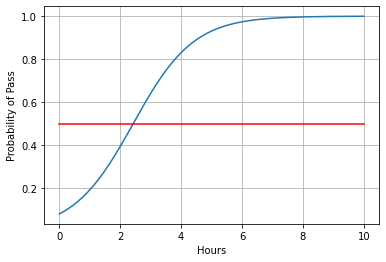

```python
import torch 
import numpy as np
import matplotlib.pyplot as plt
import torch.nn as nn
```


```python
#导入数据
x_data=torch.Tensor([[1.0],[2.0],[3.0]])
y_data=torch.Tensor([[0],[0],[1]])
```


```python
#建立模型
class Logmodel(nn.Module):
    def __init__(self):
        super(Logmodel,self).__init__()
        self.linear=nn.Linear(1,1)
    def forward(self,x):  #前馈计算
        y_pred=torch.sigmoid(self.linear(x))
        return y_pred
```


```python
model=Logmodel() #实例化
```


```python
criterion=nn.BCELoss(reduction='sum')
optimizer=torch.optim.SGD(model.parameters(),lr=0.01) #计算损失和优化器
```


```python
#模型训练
for epoch in range(1000):
    y_pred=model(x_data)
    loss=criterion(y_pred,y_data)
    #print(epoch,loss.item())
    optimizer.zero_grad()
    loss.backward()
    optimizer.step()
```


```python


'''
numpy.linspace(start, stop, num=50, endpoint=True, retstep=False, dtype=None)
在指定的间隔内返回均匀间隔的数字。
返回num均匀分布的样本，在[start, stop]。
这个区间的端点可以任意的被排除在外。
'''
x = np.linspace(0,10,200)   #在0~10中，均匀取出200个点
# print(x)
x_t = torch.Tensor(x).view(200,1)  #将200个点变成（200,1）的张量
# print(x_t)
y_t = model(x_t)  #得到y_pred_t是个张量
# print(y_t)
y = y_t.data.numpy() #将y_pred_t张量转化为矩阵形式
# print(y)
plt.plot(x,y)
plt.plot([0,10],[0.5,0.5],c='r')
plt.xlabel('Hours')
plt.ylabel('Probability of Pass')
plt.grid()
plt.show()


```




