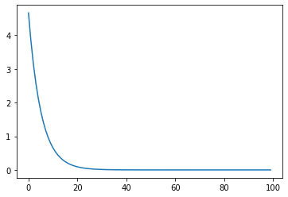

# 梯度下降法


```python
import matplotlib.pyplot as plt
x_data =[1.0,2.0,3.0]
y_data=[2.0,4.0,6.0]
w=1.0
```


```python
def forward(x):
    return x*w #前向传播
```


```python
def cost(xs,ys):
    cost=0
    for x,y in zip(xs,ys):
        y_pred=forward(x)
        cost+=(y_pred-y)**2 #计算每一项损失
    return cost/len(xs) #计算mse
```


```python
def gradient(xs,ys):
    grad=0
    for x,y in zip(xs,ys):
        grad+=2*x*(x*w-y) #cost对w偏导数
    return grad/len(xs)
```


```python
print('Predict (before training)',4,forward(4))
epoch_list=[]
cost_val_list=[]
for epoch in range(100):
    epoch_list.append(epoch)
    cost_val=cost(x_data,y_data)
    cost_val_list.append(cost_val)
    grad_val=gradient(x_data,y_data)
    w-=0.01*grad_val
    print('epoch:',epoch,'w=',w,'loss=',cost_val)
print('Predict (after training)',4,forward(4))


```

    Predict (before training) 4 4.0
    epoch: 0 w= 1.0933333333333333 loss= 4.666666666666667
    epoch: 1 w= 1.1779555555555554 loss= 3.8362074074074086
    epoch: 2 w= 1.2546797037037036 loss= 3.1535329869958857
    epoch: 3 w= 1.3242429313580246 loss= 2.592344272332262
    epoch: 4 w= 1.3873135910979424 loss= 2.1310222071581117
    epoch: 5 w= 1.4444976559288012 loss= 1.7517949663820642
    epoch: 6 w= 1.4963445413754464 loss= 1.440053319920117
    epoch: 7 w= 1.5433523841804047 loss= 1.1837878313441108
    epoch: 8 w= 1.5859728283235668 loss= 0.9731262101573632
    epoch: 9 w= 1.6246153643467005 loss= 0.7999529948031382
    epoch: 10 w= 1.659651263674342 loss= 0.6575969151946154
    epoch: 11 w= 1.6914171457314033 loss= 0.5405738908195378
    epoch: 12 w= 1.7202182121298057 loss= 0.44437576375991855
    epoch: 13 w= 1.7463311789976905 loss= 0.365296627844598
    epoch: 14 w= 1.7700069356245727 loss= 0.3002900634939416
    epoch: 15 w= 1.7914729549662791 loss= 0.2468517784170642
    epoch: 16 w= 1.8109354791694263 loss= 0.2029231330489788
    epoch: 17 w= 1.8285815011136133 loss= 0.16681183417217407
    epoch: 18 w= 1.8445805610096762 loss= 0.1371267415488235
    epoch: 19 w= 1.8590863753154396 loss= 0.11272427607497944
    epoch: 20 w= 1.872238313619332 loss= 0.09266436490145864
    epoch: 21 w= 1.8841627376815275 loss= 0.07617422636521683
    epoch: 22 w= 1.8949742154979183 loss= 0.06261859959338009
    epoch: 23 w= 1.904776622051446 loss= 0.051475271914629306
    epoch: 24 w= 1.9136641373266443 loss= 0.04231496130368814
    epoch: 25 w= 1.9217221511761575 loss= 0.03478477885657844
    epoch: 26 w= 1.9290280837330496 loss= 0.02859463421027894
    epoch: 27 w= 1.9356521292512983 loss= 0.023506060193480772
    epoch: 28 w= 1.9416579305211772 loss= 0.01932302619282764
    epoch: 29 w= 1.9471031903392007 loss= 0.015884386331668398
    epoch: 30 w= 1.952040225907542 loss= 0.01305767153735723
    epoch: 31 w= 1.9565164714895047 loss= 0.010733986344664803
    epoch: 32 w= 1.9605749341504843 loss= 0.008823813841374291
    epoch: 33 w= 1.9642546069631057 loss= 0.007253567147113681
    epoch: 34 w= 1.9675908436465492 loss= 0.005962754575689583
    epoch: 35 w= 1.970615698239538 loss= 0.004901649272531298
    epoch: 36 w= 1.9733582330705144 loss= 0.004029373553099482
    epoch: 37 w= 1.975844797983933 loss= 0.0033123241439168096
    epoch: 38 w= 1.9780992835054327 loss= 0.0027228776607060357
    epoch: 39 w= 1.980143350378259 loss= 0.002238326453885249
    epoch: 40 w= 1.9819966376762883 loss= 0.001840003826269386
    epoch: 41 w= 1.983676951493168 loss= 0.0015125649231412608
    epoch: 42 w= 1.9852004360204722 loss= 0.0012433955919298103
    epoch: 43 w= 1.9865817286585614 loss= 0.0010221264385926248
    epoch: 44 w= 1.987834100650429 loss= 0.0008402333603648631
    epoch: 45 w= 1.9889695845897222 loss= 0.0006907091659248264
    epoch: 46 w= 1.9899990900280147 loss= 0.0005677936325753796
    epoch: 47 w= 1.9909325082920666 loss= 0.0004667516012495216
    epoch: 48 w= 1.9917788075181404 loss= 0.000383690560742734
    epoch: 49 w= 1.9925461188164473 loss= 0.00031541069384432885
    epoch: 50 w= 1.9932418143935788 loss= 0.0002592816085930997
    epoch: 51 w= 1.9938725783835114 loss= 0.0002131410058905752
    epoch: 52 w= 1.994444471067717 loss= 0.00017521137977565514
    epoch: 53 w= 1.9949629871013967 loss= 0.0001440315413480261
    epoch: 54 w= 1.9954331083052663 loss= 0.0001184003283899171
    epoch: 55 w= 1.9958593515301082 loss= 9.733033217332803e-05
    epoch: 56 w= 1.9962458120539648 loss= 8.000985883901657e-05
    epoch: 57 w= 1.9965962029289281 loss= 6.57716599593935e-05
    epoch: 58 w= 1.9969138906555615 loss= 5.406722767150764e-05
    epoch: 59 w= 1.997201927527709 loss= 4.444566413387458e-05
    epoch: 60 w= 1.9974630809584561 loss= 3.65363112808981e-05
    epoch: 61 w= 1.9976998600690001 loss= 3.0034471708953996e-05
    epoch: 62 w= 1.9979145397958935 loss= 2.4689670610172655e-05
    epoch: 63 w= 1.9981091827482769 loss= 2.0296006560253656e-05
    epoch: 64 w= 1.9982856590251044 loss= 1.6684219437262796e-05
    epoch: 65 w= 1.9984456641827613 loss= 1.3715169898293847e-05
    epoch: 66 w= 1.9985907355257035 loss= 1.1274479219506377e-05
    epoch: 67 w= 1.9987222668766378 loss= 9.268123006398985e-06
    epoch: 68 w= 1.9988415219681517 loss= 7.61880902783969e-06
    epoch: 69 w= 1.9989496465844576 loss= 6.262999634617916e-06
    epoch: 70 w= 1.9990476795699081 loss= 5.1484640551938914e-06
    epoch: 71 w= 1.9991365628100501 loss= 4.232266273994499e-06
    epoch: 72 w= 1.999217150281112 loss= 3.479110977946351e-06
    epoch: 73 w= 1.999290216254875 loss= 2.859983851026929e-06
    epoch: 74 w= 1.9993564627377531 loss= 2.3510338359374262e-06
    epoch: 75 w= 1.9994165262155628 loss= 1.932654303533636e-06
    epoch: 76 w= 1.999470983768777 loss= 1.5887277332523938e-06
    epoch: 77 w= 1.9995203586170245 loss= 1.3060048068548734e-06
    epoch: 78 w= 1.9995651251461022 loss= 1.0735939958924364e-06
    epoch: 79 w= 1.9996057134657994 loss= 8.825419799121559e-07
    epoch: 80 w= 1.9996425135423248 loss= 7.254887315754342e-07
    epoch: 81 w= 1.999675878945041 loss= 5.963839812987369e-07
    epoch: 82 w= 1.999706130243504 loss= 4.902541385825727e-07
    epoch: 83 w= 1.9997335580874436 loss= 4.0301069098738336e-07
    epoch: 84 w= 1.9997584259992822 loss= 3.312926995781724e-07
    epoch: 85 w= 1.9997809729060159 loss= 2.723373231729343e-07
    epoch: 86 w= 1.9998014154347876 loss= 2.2387338352920307e-07
    epoch: 87 w= 1.9998199499942075 loss= 1.8403387118941732e-07
    epoch: 88 w= 1.9998367546614149 loss= 1.5128402140063082e-07
    epoch: 89 w= 1.9998519908930161 loss= 1.2436218932547864e-07
    epoch: 90 w= 1.9998658050763347 loss= 1.0223124683409346e-07
    epoch: 91 w= 1.9998783299358769 loss= 8.403862850836479e-08
    epoch: 92 w= 1.9998896858085284 loss= 6.908348768398496e-08
    epoch: 93 w= 1.9998999817997325 loss= 5.678969725349543e-08
    epoch: 94 w= 1.9999093168317574 loss= 4.66836551287917e-08
    epoch: 95 w= 1.9999177805941268 loss= 3.8376039345125727e-08
    epoch: 96 w= 1.9999254544053418 loss= 3.154680994333735e-08
    epoch: 97 w= 1.9999324119941766 loss= 2.593287985380858e-08
    epoch: 98 w= 1.9999387202080534 loss= 2.131797981222471e-08
    epoch: 99 w= 1.9999444396553017 loss= 1.752432687141379e-08
    Predict (after training) 4 7.999777758621207
    


```python
plt.plot(epoch_list,cost_val_list)
```


    [<matplotlib.lines.Line2D at 0x1d8b8b79b38>]




