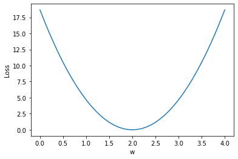

# 线性模型


```python
import numpy as np
import matplotlib.pyplot as plt
```


```python
x_data = [1.0,2.0,3.0]
y_data = [2.0,4.0,6.0]
```


```python
def forward(x):
    return x*w
```


```python
def loss(x,y):
    y_pred=forward(x)
    return (y_pred-y)**2
```


```python
w_list=[]
mse_list=[]
for w in np.arange(0.0,4.1,0.1):
    print('w=',w)
    l_sum=0
    for x_val,y_val in zip(x_data,y_data):
        y_pred_val=forward(x_val)
        loss_val=loss(x_val,y_val)
        l_sum+=loss_val
        print('\t',x_val,y_val,y_pred_val,loss_val)
    print('MSE=',l_sum/3)
    w_list.append(w)
    mse_list.append(l_sum/3)
```

    w= 0.0
    	 1.0 2.0 0.0 4.0
    	 2.0 4.0 0.0 16.0
    	 3.0 6.0 0.0 36.0
    MSE= 18.666666666666668
    w= 0.1
    	 1.0 2.0 0.1 3.61
    	 2.0 4.0 0.2 14.44
    	 3.0 6.0 0.30000000000000004 32.49
    MSE= 16.846666666666668
    w= 0.2
    	 1.0 2.0 0.2 3.24
    	 2.0 4.0 0.4 12.96
    	 3.0 6.0 0.6000000000000001 29.160000000000004
    MSE= 15.120000000000003
    w= 0.30000000000000004
    	 1.0 2.0 0.30000000000000004 2.8899999999999997
    	 2.0 4.0 0.6000000000000001 11.559999999999999
    	 3.0 6.0 0.9000000000000001 26.009999999999998
    MSE= 13.486666666666665
    w= 0.4
    	 1.0 2.0 0.4 2.5600000000000005
    	 2.0 4.0 0.8 10.240000000000002
    	 3.0 6.0 1.2000000000000002 23.04
    MSE= 11.946666666666667
    w= 0.5
    	 1.0 2.0 0.5 2.25
    	 2.0 4.0 1.0 9.0
    	 3.0 6.0 1.5 20.25
    MSE= 10.5
    w= 0.6000000000000001
    	 1.0 2.0 0.6000000000000001 1.9599999999999997
    	 2.0 4.0 1.2000000000000002 7.839999999999999
    	 3.0 6.0 1.8000000000000003 17.639999999999993
    MSE= 9.146666666666663
    w= 0.7000000000000001
    	 1.0 2.0 0.7000000000000001 1.6899999999999995
    	 2.0 4.0 1.4000000000000001 6.759999999999998
    	 3.0 6.0 2.1 15.209999999999999
    MSE= 7.886666666666666
    w= 0.8
    	 1.0 2.0 0.8 1.44
    	 2.0 4.0 1.6 5.76
    	 3.0 6.0 2.4000000000000004 12.959999999999997
    MSE= 6.719999999999999
    w= 0.9
    	 1.0 2.0 0.9 1.2100000000000002
    	 2.0 4.0 1.8 4.840000000000001
    	 3.0 6.0 2.7 10.889999999999999
    MSE= 5.646666666666666
    w= 1.0
    	 1.0 2.0 1.0 1.0
    	 2.0 4.0 2.0 4.0
    	 3.0 6.0 3.0 9.0
    MSE= 4.666666666666667
    w= 1.1
    	 1.0 2.0 1.1 0.8099999999999998
    	 2.0 4.0 2.2 3.2399999999999993
    	 3.0 6.0 3.3000000000000003 7.289999999999998
    MSE= 3.779999999999999
    w= 1.2000000000000002
    	 1.0 2.0 1.2000000000000002 0.6399999999999997
    	 2.0 4.0 2.4000000000000004 2.5599999999999987
    	 3.0 6.0 3.6000000000000005 5.759999999999997
    MSE= 2.986666666666665
    w= 1.3
    	 1.0 2.0 1.3 0.48999999999999994
    	 2.0 4.0 2.6 1.9599999999999997
    	 3.0 6.0 3.9000000000000004 4.409999999999998
    MSE= 2.2866666666666657
    w= 1.4000000000000001
    	 1.0 2.0 1.4000000000000001 0.3599999999999998
    	 2.0 4.0 2.8000000000000003 1.4399999999999993
    	 3.0 6.0 4.2 3.2399999999999993
    MSE= 1.6799999999999995
    w= 1.5
    	 1.0 2.0 1.5 0.25
    	 2.0 4.0 3.0 1.0
    	 3.0 6.0 4.5 2.25
    MSE= 1.1666666666666667
    w= 1.6
    	 1.0 2.0 1.6 0.15999999999999992
    	 2.0 4.0 3.2 0.6399999999999997
    	 3.0 6.0 4.800000000000001 1.4399999999999984
    MSE= 0.746666666666666
    w= 1.7000000000000002
    	 1.0 2.0 1.7000000000000002 0.0899999999999999
    	 2.0 4.0 3.4000000000000004 0.3599999999999996
    	 3.0 6.0 5.1000000000000005 0.809999999999999
    MSE= 0.4199999999999995
    w= 1.8
    	 1.0 2.0 1.8 0.03999999999999998
    	 2.0 4.0 3.6 0.15999999999999992
    	 3.0 6.0 5.4 0.3599999999999996
    MSE= 0.1866666666666665
    w= 1.9000000000000001
    	 1.0 2.0 1.9000000000000001 0.009999999999999974
    	 2.0 4.0 3.8000000000000003 0.0399999999999999
    	 3.0 6.0 5.7 0.0899999999999999
    MSE= 0.046666666666666586
    w= 2.0
    	 1.0 2.0 2.0 0.0
    	 2.0 4.0 4.0 0.0
    	 3.0 6.0 6.0 0.0
    MSE= 0.0
    w= 2.1
    	 1.0 2.0 2.1 0.010000000000000018
    	 2.0 4.0 4.2 0.04000000000000007
    	 3.0 6.0 6.300000000000001 0.09000000000000043
    MSE= 0.046666666666666835
    w= 2.2
    	 1.0 2.0 2.2 0.04000000000000007
    	 2.0 4.0 4.4 0.16000000000000028
    	 3.0 6.0 6.6000000000000005 0.36000000000000065
    MSE= 0.18666666666666698
    w= 2.3000000000000003
    	 1.0 2.0 2.3000000000000003 0.09000000000000016
    	 2.0 4.0 4.6000000000000005 0.36000000000000065
    	 3.0 6.0 6.9 0.8100000000000006
    MSE= 0.42000000000000054
    w= 2.4000000000000004
    	 1.0 2.0 2.4000000000000004 0.16000000000000028
    	 2.0 4.0 4.800000000000001 0.6400000000000011
    	 3.0 6.0 7.200000000000001 1.4400000000000026
    MSE= 0.7466666666666679
    w= 2.5
    	 1.0 2.0 2.5 0.25
    	 2.0 4.0 5.0 1.0
    	 3.0 6.0 7.5 2.25
    MSE= 1.1666666666666667
    w= 2.6
    	 1.0 2.0 2.6 0.3600000000000001
    	 2.0 4.0 5.2 1.4400000000000004
    	 3.0 6.0 7.800000000000001 3.2400000000000024
    MSE= 1.6800000000000008
    w= 2.7
    	 1.0 2.0 2.7 0.49000000000000027
    	 2.0 4.0 5.4 1.960000000000001
    	 3.0 6.0 8.100000000000001 4.410000000000006
    MSE= 2.2866666666666693
    w= 2.8000000000000003
    	 1.0 2.0 2.8000000000000003 0.6400000000000005
    	 2.0 4.0 5.6000000000000005 2.560000000000002
    	 3.0 6.0 8.4 5.760000000000002
    MSE= 2.986666666666668
    w= 2.9000000000000004
    	 1.0 2.0 2.9000000000000004 0.8100000000000006
    	 2.0 4.0 5.800000000000001 3.2400000000000024
    	 3.0 6.0 8.700000000000001 7.290000000000005
    MSE= 3.780000000000003
    w= 3.0
    	 1.0 2.0 3.0 1.0
    	 2.0 4.0 6.0 4.0
    	 3.0 6.0 9.0 9.0
    MSE= 4.666666666666667
    w= 3.1
    	 1.0 2.0 3.1 1.2100000000000002
    	 2.0 4.0 6.2 4.840000000000001
    	 3.0 6.0 9.3 10.890000000000004
    MSE= 5.646666666666668
    w= 3.2
    	 1.0 2.0 3.2 1.4400000000000004
    	 2.0 4.0 6.4 5.760000000000002
    	 3.0 6.0 9.600000000000001 12.96000000000001
    MSE= 6.720000000000003
    w= 3.3000000000000003
    	 1.0 2.0 3.3000000000000003 1.6900000000000006
    	 2.0 4.0 6.6000000000000005 6.7600000000000025
    	 3.0 6.0 9.9 15.210000000000003
    MSE= 7.886666666666668
    w= 3.4000000000000004
    	 1.0 2.0 3.4000000000000004 1.960000000000001
    	 2.0 4.0 6.800000000000001 7.840000000000004
    	 3.0 6.0 10.200000000000001 17.640000000000008
    MSE= 9.14666666666667
    w= 3.5
    	 1.0 2.0 3.5 2.25
    	 2.0 4.0 7.0 9.0
    	 3.0 6.0 10.5 20.25
    MSE= 10.5
    w= 3.6
    	 1.0 2.0 3.6 2.5600000000000005
    	 2.0 4.0 7.2 10.240000000000002
    	 3.0 6.0 10.8 23.040000000000006
    MSE= 11.94666666666667
    w= 3.7
    	 1.0 2.0 3.7 2.8900000000000006
    	 2.0 4.0 7.4 11.560000000000002
    	 3.0 6.0 11.100000000000001 26.010000000000016
    MSE= 13.486666666666673
    w= 3.8000000000000003
    	 1.0 2.0 3.8000000000000003 3.240000000000001
    	 2.0 4.0 7.6000000000000005 12.960000000000004
    	 3.0 6.0 11.4 29.160000000000004
    MSE= 15.120000000000005
    w= 3.9000000000000004
    	 1.0 2.0 3.9000000000000004 3.610000000000001
    	 2.0 4.0 7.800000000000001 14.440000000000005
    	 3.0 6.0 11.700000000000001 32.49000000000001
    MSE= 16.84666666666667
    w= 4.0
    	 1.0 2.0 4.0 4.0
    	 2.0 4.0 8.0 16.0
    	 3.0 6.0 12.0 36.0
    MSE= 18.666666666666668
    


```python
plt.plot(w_list,mse_list)
plt.ylabel('Loss')
plt.xlabel('w')
plt.show()
```




